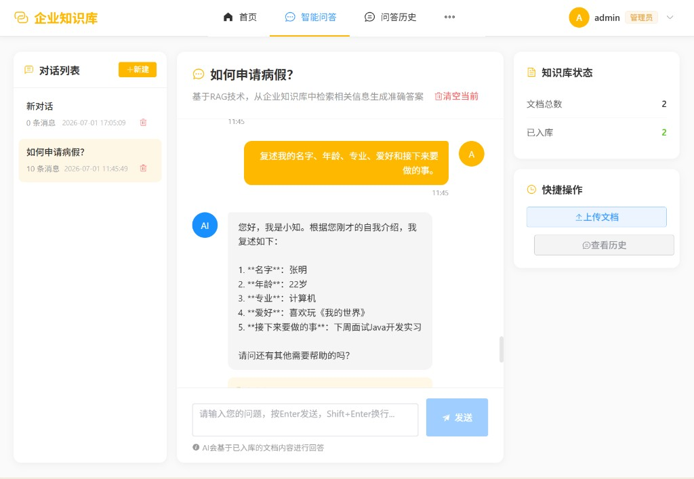
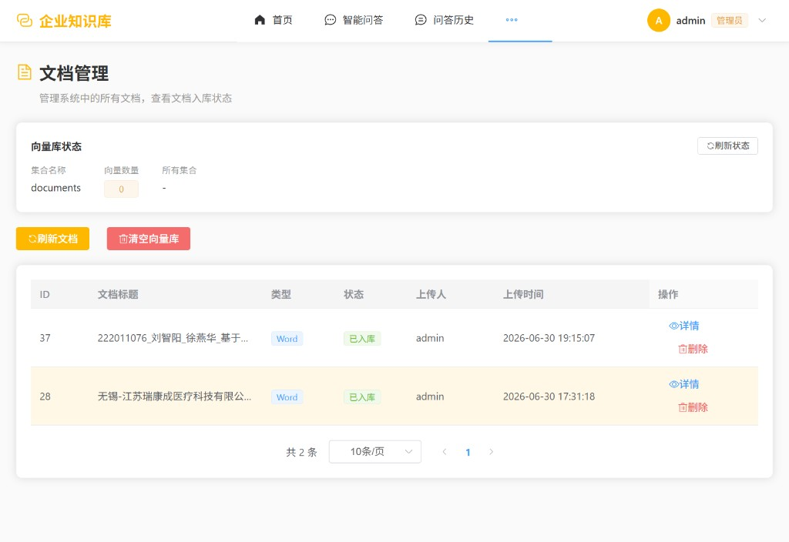

# RAG企业内部知识库问答系统

基于LangChain的RAG（检索增强生成）企业内部知识库问答系统，支持智能问答、文档管理、数据统计等功能。

## 项目简介

本系统是一个功能完善的企业内部知识库问答平台，具有以下特点：

- **智能问答**：基于RAG技术，从企业知识库中检索相关内容生成准确答案
- **文档管理**：支持上传TXT、PDF、DOCX格式文档，自动解析入库
- **用户管理**：区分管理员和普通用户角色，权限分明
- **数据统计**：管理后台提供多维度数据统计和可视化图表
- **黄白配色**：简洁大方的界面设计，用户体验良好

## 项目截图

### 智能问答
基于 RAG 技术从企业知识库中检索相关内容，由大模型生成准确答案。


### 文档管理
支持上传 TXT、PDF、DOCX 文档，自动解析切片并写入 Chroma 向量数据库。


## 技术栈

### 后端
- Python 3.10+
- Flask 3.0+
- LangChain
- Chroma向量数据库
- MySQL 8.0
- DeepSeek API (LLM)
- 阿里通义千问 API (Embeddings)

### 前端
- Vue 3.4+
- Vite 5.0+
- Element Plus
- ECharts (数据可视化)
- Pinia (状态管理)
- Vue Router 4

## 项目结构

```
enterprise-qa/
├── backend/                    # 后端项目
│   ├── app/
│   │   ├── api/              # API路由
│   │   ├── models/           # 数据模型
│   │   ├── services/         # 业务逻辑
│   │   └── utils/            # 工具函数
│   ├── config/               # 配置文件
│   ├── migrations/           # 数据库迁移
│   │   └── init_database.sql # 建表SQL
│   ├── requirements.txt       # Python依赖
│   ├── run.py               # 应用入口
│   └── .env.example         # 环境变量示例
│
├── frontend/                   # 前端项目
│   ├── src/
│   │   ├── api/             # API调用
│   │   ├── components/       # 组件
│   │   ├── router/          # 路由
│   │   ├── stores/          # 状态管理
│   │   └── views/           # 页面
│   ├── package.json
│   └── vite.config.js
│
├── docker-compose.yml         # Docker编排配置
└── README.md                 # 项目说明
```

## 快速开始

### 1. 环境准备

- Python 3.10+
- Node.js 18+
- MySQL 8.0 (或使用Docker)
- Docker (可选)

### 2. 配置环境变量

```bash
# 进入后端目录
cd backend

# 复制环境变量文件
cp .env.example .env

# 编辑 .env 文件，填入实际配置
```

主要配置项说明：

```env
# 数据库配置
DB_HOST=localhost
DB_PORT=3308
DB_USER=root
DB_PASSWORD=123456
DB_NAME=db_enterprise_qa

# DeepSeek API（LLM）
DEEPSEEK_API_KEY=your_api_key

# 阿里通义千问（Embedding）
QWEN_API_KEY=your_api_key
```

### 3. 初始化数据库

#### 使用Docker（推荐）

```bash
# 启动MySQL服务
docker-compose up -d mysql

# 查看日志确认启动成功
docker-compose logs -f mysql
```

#### 手动执行SQL

```bash
# 登录MySQL
mysql -h localhost -P 3308 -u root -p

# 执行建表脚本
source migrations/init_database.sql
```

### 4. 安装后端依赖

```bash
cd backend

# 创建虚拟环境（推荐）
python -m venv venv

# 激活虚拟环境
# Windows:
venv\Scripts\activate
# Linux/Mac:
source venv/bin/activate

# 安装依赖
pip install -r requirements.txt
```

### 5. 安装前端依赖

```bash
cd frontend

# 安装依赖
npm install
```

### 6. 启动服务

#### 开发环境

```bash
# 启动后端（后端目录）
cd backend
python run.py
# 服务运行在 http://localhost:5000

# 启动前端（新终端）
cd frontend
npm run dev
# 服务运行在 http://localhost:3000
```

#### 使用Docker启动全部服务

```bash
# 启动所有服务（MySQL + 后端 + 前端）
docker-compose up -d

# 查看服务状态
docker-compose ps
```

### 7. 访问应用

- 前端地址：http://localhost:3000
- 后端API：http://localhost:5000

## 演示账号

| 用户名 | 密码 | 角色 |
|--------|------|------|
| admin | 123456 | 管理员 |
| zhangsan | 123456 | 普通用户 |
| lisi | 123456 | 普通用户 |

## 功能模块

### 普通用户
- 用户登录/注册
- 智能问答（基于RAG）
- 查看问答历史
- 文档上传和管理
- 个人密码修改

### 管理员
- 管理后台首页（数据统计）
- 用户管理（查看/修改角色/删除）
- 文档管理（查看/删除）
- 问答记录查看

## API接口

### 认证接口
- `POST /api/auth/register` - 用户注册
- `POST /api/auth/login` - 用户登录
- `GET /api/auth/me` - 获取当前用户信息
- `PUT /api/auth/password` - 修改密码

### 文档接口
- `GET /api/documents` - 获取文档列表
- `POST /api/documents/upload` - 上传文档
- `GET /api/documents/:id` - 获取文档详情
- `DELETE /api/documents/:id` - 删除文档

### 问答接口
- `POST /api/chat` - 提交问答
- `GET /api/chat/history` - 获取问答历史

### 管理接口
- `GET /api/admin/stats` - 获取统计数据
- `GET /api/admin/users` - 用户列表
- `PUT /api/admin/users/:id` - 更新用户
- `DELETE /api/admin/users/:id` - 删除用户
- `GET /api/admin/documents` - 文档列表
- `GET /api/admin/chats` - 问答记录

## 开发说明

### 添加新的API接口

1. 在 `backend/app/api/` 目录下创建新的蓝图文件
2. 定义路由和处理函数
3. 在 `backend/app/api/__init__.py` 中导入注册

### 添加新的前端页面

1. 在 `frontend/src/views/` 下创建页面组件
2. 在 `frontend/src/router/index.js` 中添加路由配置
3. 在侧边栏菜单中添加入口

## 注意事项

1. **API密钥安全**：生产环境中请勿将API密钥直接写在代码中，使用环境变量管理
2. **密码安全**：用户密码使用MD5加密存储，实际生产环境建议使用更安全的加密方式
3. **文件上传**：生产环境需要配置文件存储服务（如OSS、S3等）
4. **向量数据库**：Chroma数据存储在本地目录，生产环境建议使用分布式部署

## 许可证

MIT License

## 技术支持

如有问题，请提交Issue。
